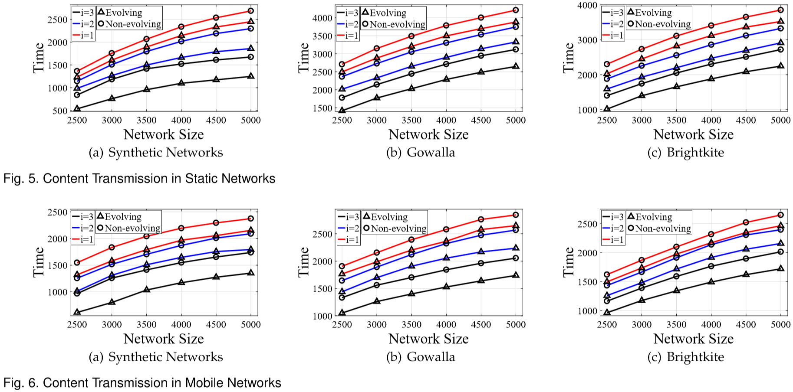

# Content Transmission in Evolving Wireless Social Networks
+ Adopted the *Affiliation Networks* model to resemble an evolving network
+ Designed a *Time Division Multiple Access* transmission scheme to utilize both geographic locations and socialrelationships while reducing interference and delay
+ Derived bounds for diffusion time in both static and mobile cases
+ Generated datasets of different scales from synthetic models and real-world databases to carry out simulations. Results exhibit an average 15% higher propagation efficiency in evolving models than non-evolving models

---
Datasets of location based online social networks are obtained from [Stanford Network Analysis Project](http://snap.stanford.edu/index.html):

1. [Gowalla](http://snap.stanford.edu/data/loc-Gowalla.html) (196591 nodes, 950327 edges)
2. [Brightkite](http://snap.stanford.edu/data/loc-Brightkite.html) (58228 nodes, 214078 edges)